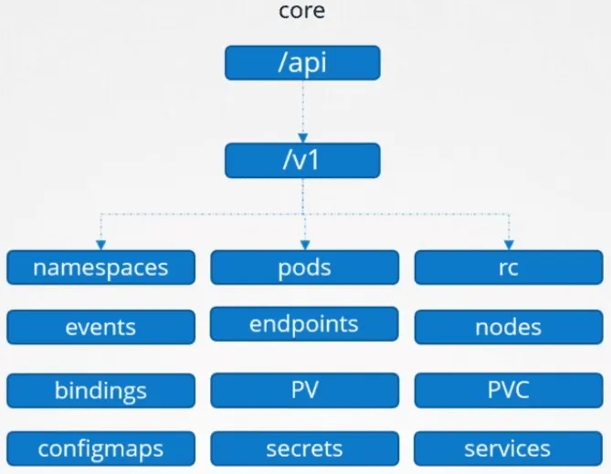

# K8S API Core Group

tags: #api

---

- **core / legacy group**
- **REST path:** `/api/v1`
- not specified in `apiVersion` field (`apiVersion: v1`)

schema:

- `/api`
  - /[[v1]]
    **resources:**
    - `namespaces`
    - `pods`
    - `rc`
    - `events`
    - `endpoints`
    - `nodes`
    - `bindings`
    - `PV`
    - `PVC`
    - `configmaps`
    - `secrets`
    - `services`
      **verbs:**
      - `list`
      - `get`
      - `create`
      - `delete`
      - `update`
      - `watch`

