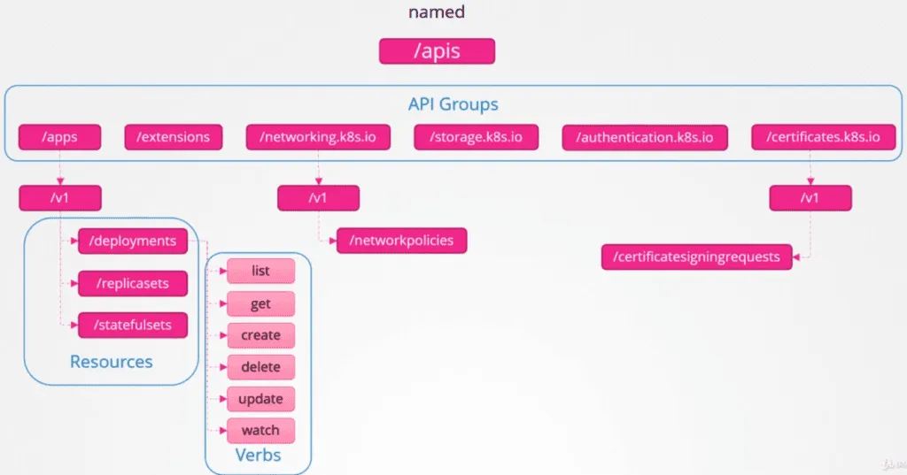

# K8S API Named Groups

tags: #api

---

- **named groups**
- **REST path:** `/apis/$GROUP_NAME/$VERSION`
- use `apiVersion: $GROUP_NAME/$VERSION` (`apiVersion: batch/v1`)

schema:

- `/apis`
  - /[[extensions]]
  - /[[storage.k8s.io]]
  - /[[authentication.k8s.io]]
  - /[[certificates.k8s.io]]
  - /[[networking.k8s.io]]
  - /[[apps]]
    **API versions:**
    - `/v1`
      **resources:**
      - `/replicasets`
      - `/statefulsets`
      - `/deployments`
        **verbs:**
        - `list`
        - `get`
        - `create`
        - `delete`
        - `update`
        - `watch`

