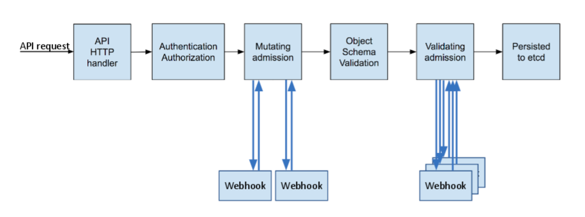

# K8S AdmissionController

tags: #security

<!-- @import "[TOC]" {cmd="toc" depthFrom=1 depthTo=6 orderedList=false} -->

<!-- code_chunk_output -->

- [K8S AdmissionController](#k8s-admissioncontroller)
    - [Dynamic AdmissionController](#dynamic-admissioncontroller)

<!-- /code_chunk_output -->

---

intercepts requests to the kubernetes api server

- prior to persistence of the object
- after the request is authenticated and authorized.
- admission controllers may be **validating**, **mutating**, **or both**:
  - **mutating controllers** may modify request objects
  - **validating controllers** may not



**Pre-built** admission controllers:

- AlwaysPullImages
- DefaultStorageClass
- EventRateLimit
- NamespaceExists
- NamespaceAutoProvision
- DefaultStorageClass
- ...

view enabled admission controllers

```bash
kube-apiserver -h | grep enable-admission-plugin

# in a kubeadm setup, run in kube apiserver controlplane pod
kubectl exec kube-apiserver-controlplane -n kube-system -- \
  kube-apiserver -h | grep enable-admission-plugin
```

add admission controller via command

```bash
/usr/local/bin/kube-apiserver \
  ...
  --enable-admission-plugins=NodeRestriction,...
  --disable-admission-plugins=DefaultStorageClass,...
  ...
```

add admission controller via kube-apiserver definition file

```yaml
apiVersion: v1
kind: Pod
metadata:
  name: kube-apiserver
  namespace: kube-system

spec:
  containers:
  - command:
    - kube-apiserver
    - ...
    - --enable-admission-plugins=NodeRestriction,...
    - --disable-admission-plugins=DefaultStorageClass,...
    - ...
    image: k8s.gcr.io/kube-apiserver-amd64:v1.11.3
    name: kube-apiserver
    ...
```

### Dynamic AdmissionController

[[dynamic_admission_controller]]
