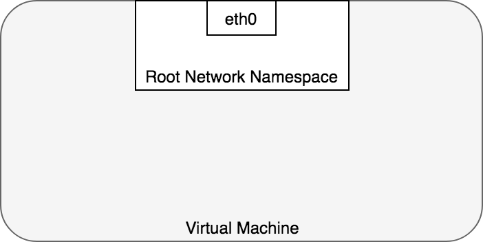
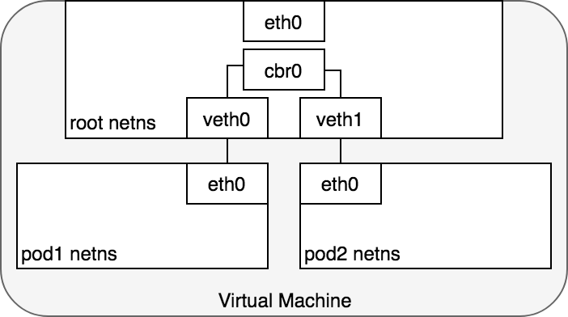
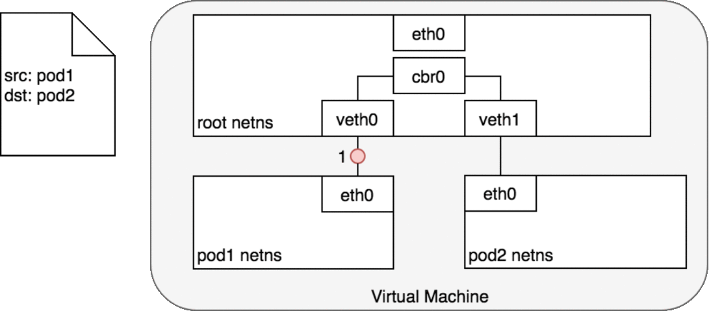
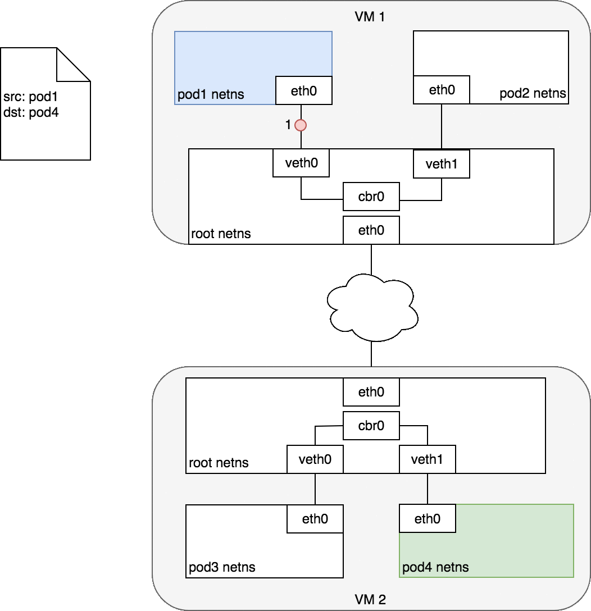
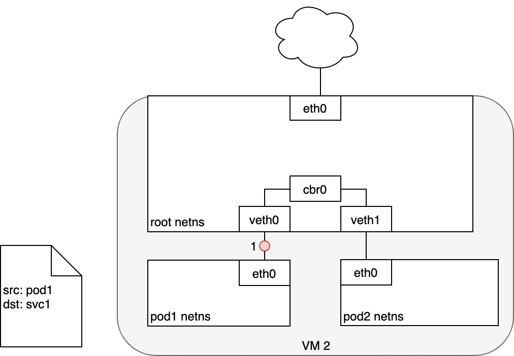

# Kubernetes Networking Model

tags: #network

<!-- @import "[TOC]" {cmd="toc" depthFrom=1 depthTo=6 orderedList=false} -->

<!-- code_chunk_output -->

- [Kubernetes Networking Model](#kubernetes-networking-model)
  - [Architecture](#architecture)
  - [Pipe/Virtual Cable Network Namespace Setup](#pipevirtual-cable-network-namespace-setup)
  - [Networking in Docker](#networking-in-docker)

<!-- /code_chunk_output -->

---

see:

- A Guide to the Kubernetes Networking Model
  https://sookocheff.com/post/kubernetes/understanding-kubernetes-networking-model/
  `img/understanding-kubernetes-networking-model.png`

## Architecture

**[network namespaces](https://man7.org/linux/man-pages/man8/ip-netns.8.html):**

 - provides a **logical networking stack** with its own routes, firewall rules, and network devices.
 - provides a brand new network stack for all the processes within the namespace.
 - when namespace is created, a mount point for it is created under `/var/run/netns`, allowing the namespace to persist even if there is no process attached to it.
 - can list available namespaces by listing all the mount points under `/var/run/netns`

- by default, Linux assigns every process to the root network namespace to provide access to the external world

- a Pod is modelled as a group of Docker containers that share a network namespace, isolate each Pod to their own networking stack
  - Containers within a Pod all have the same IP address and port space assigned through the network namespace assigned to the Pod,
  - can find each other via localhost since they reside in the same namespace.

**pod-to-pod networking:**

- namespaces can be connected using a Linux [Virtual Ethernet Device](http://man7.org/linux/man-pages/man4/veth.4.html) or **_veth pair_** (**veth0-eth0**; **veth1-eth0**)
	- consists of two virtual interfaces can be spread over multiple namespaces
- use a **network _bridge_ (cbr0)** so that pods talk to each other through the root namespace
	- a virtual Layer 2 networking device used to unite two or more network segments
	- implement the [ARP](https://en.wikipedia.org/wiki/Address_Resolution_Protocol) protocol to discover the link-layer MAC address associated with a given IP address
		- bridge broadcasts the frame out to all connected devices (except the original sender) and the device that responds to the frame is stored in a lookup table
		- future traffic with the same IP address uses the lookup table to discover the correct MAC address to forward the packet to

**pod-to-pod cross-node networking:**

- every Node in your cluster is assigned a CIDR block specifying the IP addresses available to Pods running on that Node
	- when traffic destined for the CIDR block reaches the Node it is the Node’s responsibility to forward traffic to the correct Pod
- (2) ARP will fail at the bridge because there is no device connected to the bridge with the correct MAC address for the packet.
	- On failure, the bridge sends the packet out the default route — the root namespace’s `eth0` device. At this point the route leaves the Node and enters the network

**pod-to-service networking:**

- ARP protocol running on the bridge does not know about the Service and so it transfers the packet out through the default route — eth0 (3).
- before being accepted at eth0, the packet is filtered through iptables (4)
  - iptables uses the rules installed on the Node by kube-proxy in response to Service or Pod events to rewrite the destination of the packet from the Service IP to a specific Pod IP (4)
- Linux kernel’s conntrack utility is leveraged by iptables to remember the Pod choice that was made so future traffic is routed to the same Pod (barring any scaling events) (5)

**IPVS (IP Virtual Server)**

- k8s release >= 1.11
- built on top of netfilter, implements transport-layer load balancing as part of the Linux kernel. 
- is incorporated into the LVS (Linux Virtual Server), runs on a host and acts as a load balancer in front of a cluster of real servers
- can direct requests for TCP- and UDP-based services to the real servers
  - make services of the real servers appear as virtual services on a single IP address
- is specifically designed for load balancing and uses more efficient data structures (hash tables)
- when creating a Service load balanced with IPVS: 
  1. a dummy IPVS interface is created on the Node, 
  2. the Service’s IP address is bound to the dummy IPVS interface,
  3. IPVS servers are created for each Service IP address.

---

## Pipe/Virtual Cable Network Namespace Setup

for technicals see: commands > Network Namespaces

1. **create netns**
1. **create virtual/bridge network** (interface)
1. **create `veth` pipe/ virt-cable** w/ its 2 interfaces/ends
1. **attach `veth` interface** to netns
1. **attach other `veth` interface** to the bridge
1. **assign ip addr** to interfaces
1. **activate interfaces**
1. **enable NAT-IP masquerade** for egress

**virtual networks/switches** solutions:

- Linux Bridge
- Open vSwitch (OvS)

**setup Linux Bridge** for virtual networks

- **create network namespaces and virtual/bridge network** (host interface)
- **link netns and virt-network** using virt-cable
- **enable egress traffic from** netns
  - configure routes on netns
  - enable NAT for packets routing from virt-network on host
- **(optional) enable ingress traffic to** netns
  - **option 1:** define route in the source: `ip route add <netns-addr> via <host-addr>`
  - **option 2:** configure port forwarding on host: `ip route add <netns-addr> via <host-addr>`

> **Note:** in this setup, the host provides to netns:
>
> - gateway
> - default gateway
> - NAT

---

## Networking in Docker

docker network types:

- **none:** unreachable to/from the ouside
- **host:** contianer is attached to host network (share host ports)
- **bridge:**
  - default network `docker0`
  - internal private network
  - nat-ed network using `docker0` bridge host interface
  - `docker0` netns `id` is present when inspecting: `containers[].NetworkSettings.SandboxID+SandboxKey`

**when a contianer is created**, docker (see netns setup above):

- creates netns
- attaches netns to bridge network
- assigns an ip addr to container interface from bridge network subnet
- **configure egress traffic:**
  - adds nat rule to iptables for nat-ing container traffic via host interface
  - configures **iptables MASQUERADE rules** for outbound traffic
  - **inside container:**
    - adds **route to outside** via host interface
    - adds **dns server addr resolv.conf** (usually host ip addr)
    - adds **gateway addr to route table** (usually bridge interface ip addr)
- **configure ingress traffic:**
  - adds route to container interface via bridge interface
  - creates DNAT rules if ports are published (-p flag)
  - updates Docker proxy rules if ports are published

**docker networking model:** Contianer Network Model (CNM)
