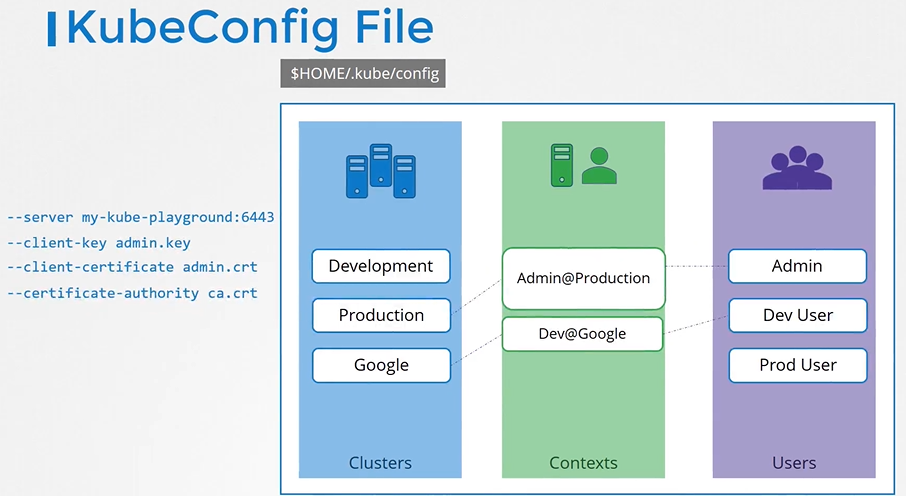

# KubeConfig

tags: #security

<!-- @import "[TOC]" {cmd="toc" depthFrom=2 depthTo=6 orderedList=false} -->

<!-- code_chunk_output -->

- [KubeConfig Architecture](#kubeconfig-architecture)
- [KubeConfig Structure and Contents](#kubeconfig-structure-and-contents)
- [Namespaces in KubeConfig](#namespaces-in-kubeconfig)
- [Samples](#samples)

<!-- /code_chunk_output -->

---

**path:** `$HOME/.kube/config`
kubeconfig removes the need for the following flags in the `curl` command

- `--server`
- `--client-key`
- `--client-certificate`
- `--certificate-authority`

**sections:**

- **Clusters**
  example: `Development`,`Production`,`Google`, `KubePlayground`
- **Contexts**
  example: `Admin@Prodction`,`Dev-user@Google`, `KubeAdmin@KubePlayground`
- **Users**
  example: `Admin`,`Dev-user`,`Prod-user`, `KubeAdmin`

## KubeConfig Architecture



## KubeConfig Structure and Contents

**kubeconfig structure:**


**kubeconfig contents:**


## Namespaces in KubeConfig


## Samples

.`kube/config` sample 1

```yaml
apiVersion: v1
kind: Config
current-context: dev-user@google # kubectl default context

clusters:
  - development
  - production
  - google
  - kubeplayground

contexts:
  - admin@prodction
  - dev-user@google
  - kubeadmin@kubeplayground

users:
  - admin
  - dev-user
  - prod-user
  - kubeadmin
```

`.kube/config` sample 2

```yaml
# <cert-base64-data>: cat ca.crt | base64
apiVersion: v1
kind: Config
current-context: admin@production # kubectl default context

clusters:
- production
  cluster:
    certificate-authority: /etc/kubernetes/pki/ca.crt
    # OR
    certificate-authority-data: <cert-base64-data>
    server: https://172.17.0.51:6443

contexts:
- admin@prodction
  context:
    cluster: production
    user: admin
    context: finance

users:
- admin
  user
    client-certificate: /etc/kubernetes/pki/users/admin.crt
    client-key: /etc/kubernetes/pki/users/admin.key
```

`.kube/config` sample 3

```yaml
apiVersion: v1
kind: Config
preferences: {}
current-context: kubernetes-admin@kubernetes
clusters:
  - cluster:
      certificate-authority-data: LS0tLS1CRUdJT.....tCg==
      server: https://controlplane:6443
    name: kubernetes
contexts:
  - context:
      cluster: kubernetes
      user: kubernetes-admin
    name: kubernetes-admin@kubernetes
users:
  - name: kubernetes-admin
    user:
      client-certificate-data: LS0tLS1CRUdJTiBDR.....S0tCg==
      client-key-data: LS0tLS1CRUdJ.....ktLS0tLQo=
```
