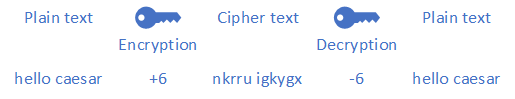
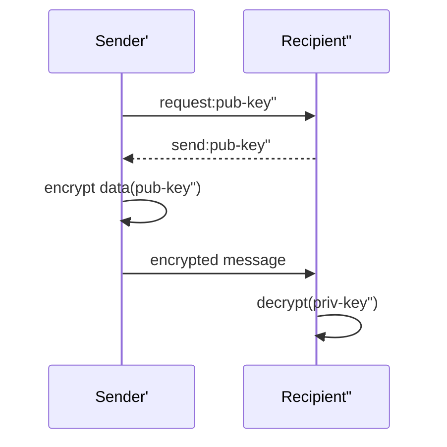
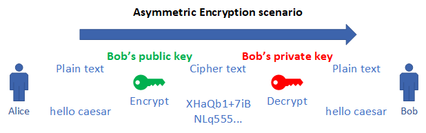
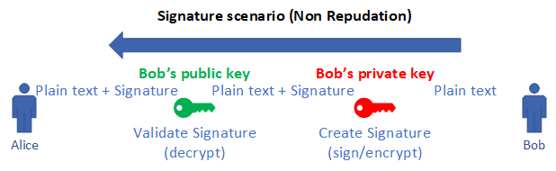
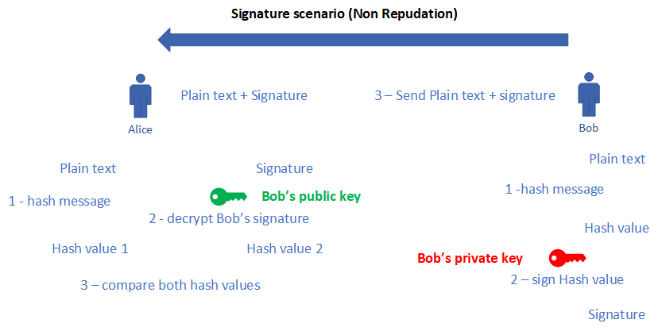
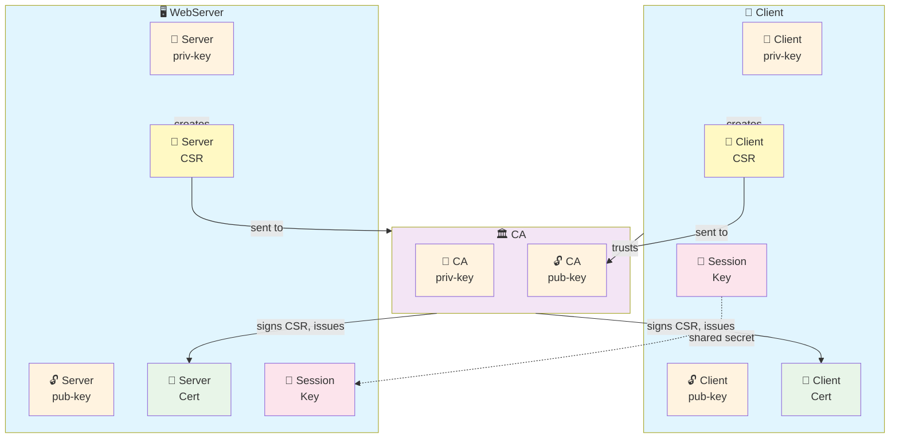
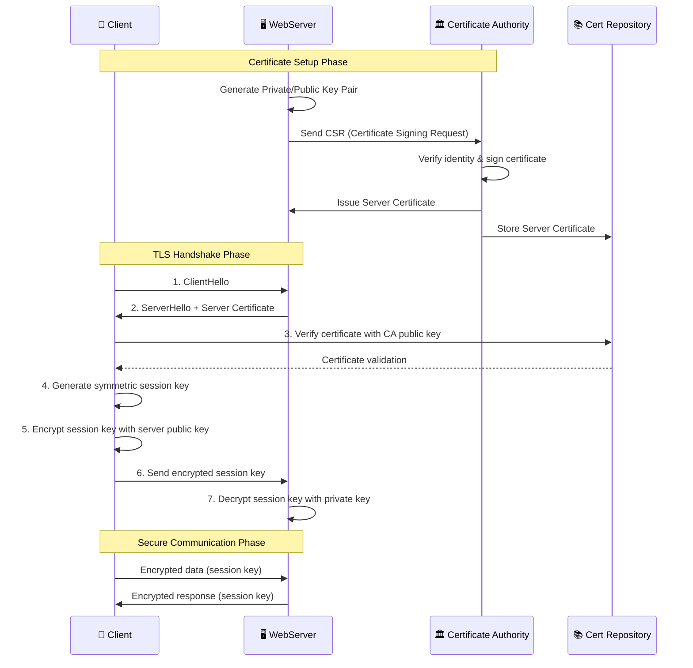

# TLS Basics

tags: #security

<!-- @import "[TOC]" {cmd="toc" depthFrom=1 depthTo=6 orderedList=false} -->

<!-- code_chunk_output -->

- [TLS Basics](#tls-basics)
  - [Symmetric encryption](#symmetric-encryption)
  - [Asymmetric encryption](#asymmetric-encryption)
  - [Certificates](#certificates)
    - [Issuing Certificates](#issuing-certificates)
    - [Certificate Authority](#certificate-authority)
  - [PKI](#pki)
    - [PKI Components & Relationships](#pki-components--relationships)
    - [TLS Communication Process](#tls-communication-process)
    - [Certificate/Key File Extensions](#certificatekey-file-extensions)

<!-- /code_chunk_output -->

---

## Symmetric encryption

- same key is used to encrypt and decrypt the message
- both sender and recipient must have access to the secret key and keep it confidential

## Asymmetric encryption

**scenario: secure communication**
Alice wants to send a confidential message to Bob.

**scenario: signature**
Alice wants to make sure the message was sent by Bob.

what Bob actually does:

- Took a hash of the message
- Encrypted the hash with his private key
- Sent the message and the hash value
- Alice hashed the message she received
- She decrypted the value of the hash sent by Bob
- And she compared both values

## Certificates

A **digital certificate** contains specific pieces of information about the **identity** of the certificate **owner** and about the **certificate authority**.

- **Subject** - who does this certificate represent
- **Signer** - who says so

### Issuing Certificates

There are **two methods to generate certificate:**

- **Client-side request**

  1. generated key pair on client
  1. creates a certificate request (CSR - Certificate signing Request)
     - contains information about the client (public key, name, email address)
  1. CSR is signed by client private key, then sent to a CA
  1. CA identifies the client before issuing certificate
     - CA verifies if the signature in the request is valid: by decrypting signed request with attached public key
  1. If client is authentic, then the certificate can be downloaded by client

- **Server-side**

  - The alternative method is to generate key pairs on the server
  - Problems: private key must be sent to the client, ensuring that that an unauthorized eavesdropper cannot access it whilst in transit
  - Distribution medium needs to be controlled - e.g. issue certificates for a small closed group of users and deliver personally on a smartcard

- **Private CA vs Public CA**
  - **Public CA:** trusted by default by most operating systems and browsers, used for public-facing services
  - **Private CA:** used within an organization, for internal services and users
    - used for internal services and users
    - allows more control over the issuance and management of certificates
    - typically used for securing internal communications, such as between microservices in a Kubernetes cluster
    - **who issues private CA?**
      - organization itself
      - third-party service that specializes in private CA management

### Certificate Authority

- **Certificate Authority**
  provides the stamp of authenticity on the certificate. It is this authority that clients must trust since the CA signs a certificate request with it private key
- **Registration Authority**
  responsible for the registration process, which determines the authenticity of the client
- **Certificate Repository**
  stores valid certificates that can be trusted
- **Certificate Revocation List**
  stores certificates that are invalid and should not be trusted

## PKI

A PKI system acts as a **trusted third party authentication system**. It **issues digital certificates** for the communication parties (for users and applications).

Some of its tasks are:

- Issuing of certificates
- Revoking of certificates
- Renewal of certificates
- Suspension and resumption of certificates
- Management of issued certificates
- Issuing a list of revoked certificates
- Protection of the private key

### PKI Components & Relationships

A PKI system consists of the following main components:
- **Actors:**
  - **End Entities**
    - users, devices, or applications that use the PKI for secure communication
  - **Certificate Authority (CA)**
    - issues and manages digital certificates
  - **Registration Authority (RA)**
    - verifies the identity of entities requesting certificates
  - **Certificate Repository**
    - stores and distributes issued certificates and revocation lists
- **Objects:**
  - **Symmetric Keys**
    - used for encrypting and decrypting data in symmetric encryption
  - **Public and Private Keys**
    - asymmetric key pairs used for encryption and decryption
  - **Digital Certificates**
    - electronic documents that use a digital signature to bind a public key with an identity

### TLS Communication Process

### Certificate/Key File Extensions

- **certificates (public key):**
  - `.crt`
  - `.cer`
  - `.pem`
- **private key files:**
  - `.key`
  - `-key.pem`
