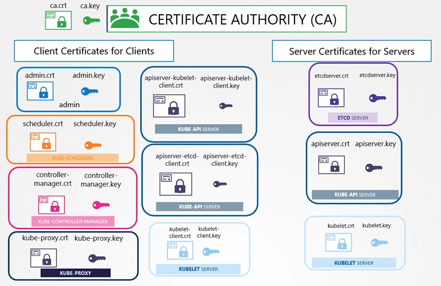

# TLS in Kubernetes

tags: #security

<!-- @import "[TOC]" {cmd="toc" depthFrom=2 depthTo=6 orderedList=false} -->

<!-- code_chunk_output -->

- [TLS Architecture](#tls-architecture)
- [TLS for kube-apiserver](#tls-for-kube-apiserver)
- [TLS for kubelets](#tls-for-kubelets)
- [Certificates API](#certificates-api)
- [KubeConfig](#kubeconfig)

<!-- /code_chunk_output -->

---

**primary requirements are:**

1. have all the services within the cluster to use **server certificates**
1. have all clients to use **client certificates**

## TLS Architecture

**cluster components TLS setup:**

- 1 minimum CA is required
- best practice:
  - CA for etcd server and client(apiserver) certs
  - CA for the rest of cluster components
- kubernetes certificates contents and paths:
  https://kubernetes.io/docs/setup/best-practices/certificates/#certificate-paths



> Note: CA is a pair of key and certificate files that are generated

**certificate generation tools:**

- `easyrsa`
- `openssl`
- `cfssl`

**TLS cluster setup steps:**

see: [kubernetes-certs-checker spreadsheet](kubernetes-certs-checker.xlsx)

1. generate **CA `ca.key`+ self-sign`ca.crt`**
1. generate **client components** `.key`+ sign `.crt`
   - **admin `admin.key`+ sign `admin.crt`**
     - specify admin group in `admin.csr` for admin privileges
   - **scheduler**
     - `scheduler.crt`
     - `scheduler.key`
   - **controller-manager**
     - `controller-manager.crt`
     - `controller-manager.key`
   - **kube-proxy**
     - `kube-proxy.crt`
     - `kube-proxy.key`
   - **apiserver-kubelet-client (kube-apiserver)**
     - `apiserver-kubelet-client.crt`
     - `apiserver-kubelet-client.key`
   - **apiserver-etcd-client (kube-apiserver)**
     - `apiserver-etcd-client.crt`
     - `apiserver-etcd-client.key`
     - group must be `../OU=system:masters`
   - **kubelet-client (kubelet)**
     - `kubelet-client.crt` + `kubelet-client.key`
     - node names must be `/CN=system:node:node01`
     - each kubelet node must have its own client `.key` and `.crt`:
       - `kubelet-node01.key`
       - `kubelet-node01.crt`
1. generate **server components** `.key`+ sign `.crt`
   - **etcd server**
     - `etcdserver.crt`
     - `etcdserver.key`
   - **etcd cluster members** (in case of HA clustering)
     must configure these certs in etcd pod yaml/service file
     - etcd peer 1: `etcdpeer1.crt` + `etcdpeer1.key`
     - etcd peer 2: `etcdpeer2.crt` + `etcdpeer2.key`
     - etcd peer 3: `etcdpeer3.crt` + `etcdpeer3.key`
   - **kube-apiserver server**
     - `apiserver.crt` + `apiserver.key`
       **apiserver URLs and IP @s** must be present in the cert info (openssl config file `openssl.cnf`):
       - `x.x.x.x` IP address
       - URLs:
         - `kubernetes`
         - `kubernetes.default`
         - `kubernetes.default.svc`
         - `kubernetes.default.svc.cluster.local`
   - **kubelet server**
     - `kubelet.crt`
     - `kubelet.key`

## TLS for kube-apiserver

Pass **TLS config to apiserver startup** cmd:

```bash
ExecStart=/usr/local/bin/kube-apiserver
  # CA cert + server TLS Configuration
  --client-ca-file=/etc/kubernetes/pki/ca.crt
  --tls-cert-file=/etc/kubernetes/pki/apiserver.crt
  --tls-private-key-file=/etc/kubernetes/pki/apiserver.key

  # Kubelet Client Configuration
  --kubelet-certificate-authority=/etc/kubernetes/pki/ca.crt
  --kubelet-client-certificate=/etc/kubernetes/pki/apiserver-kubelet-client.crt
  --kubelet-client-key=/etc/kubernetes/pki/apiserver-kubelet-client.key

  # etcd Client Configuration
  --etcd-cafile=/etc/kubernetes/pki/etcd/ca.crt
  --etcd-certfile=/etc/kubernetes/pki/apiserver-etcd-client.crt
  --etcd-keyfile=/etc/kubernetes/pki/apiserver-etcd-client.key
```

## TLS for kubelets

each kubelet node cert is named after the node

```yaml
# kubelet-config.yaml (node01)
apiVersion: kubelet.config.k8s.io/v1beta1
kind: KubeletConfiguration
metadata:
  name: kubelet-config-node01
authentication:
  x509:
    clientCAFile: /etc/kubernetes/pki/ca.pem
authorization:
  mode: Webhook
clusterDomain: "cluster.local"
clusterDNS:
  - 10.96.0.10
podCIDR: "${POD_CIDR}"
resolvConf: "/run/systemd/resolve/resolv.conf"
runtimeRequestTimeout: "15m"
tlsCertFile: /var/lib/kubelet/pki/kubelet-node01.crt
tlsPrivateKeyFile: /var/lib/kubelet/pki/kubelet-node01.key
```

## Certificates API

allows us to manage `.csr` requests through kubernetes API:

- user first creates a key
- generates a CSR
- wrap CSR in `CertificateSigningRequest` resource and create it
  - `req.csr` in the .yaml **must be** `base64` encoded
- extract certificate in k8s CSR object under `.status.certificate`
  - certificate is `base64` encoded
- send certificate to user

certificate releated operations are carried out by the controller manager.

- controllers: `CSR-Approving`, `CSR-Signing`
- requires CA Servers, root certificate and private key
  - controller manager options: `--cluster-signign-cert-file`, `--cluster-signign-key-file`

## KubeConfig

[[kubeconfig]]
